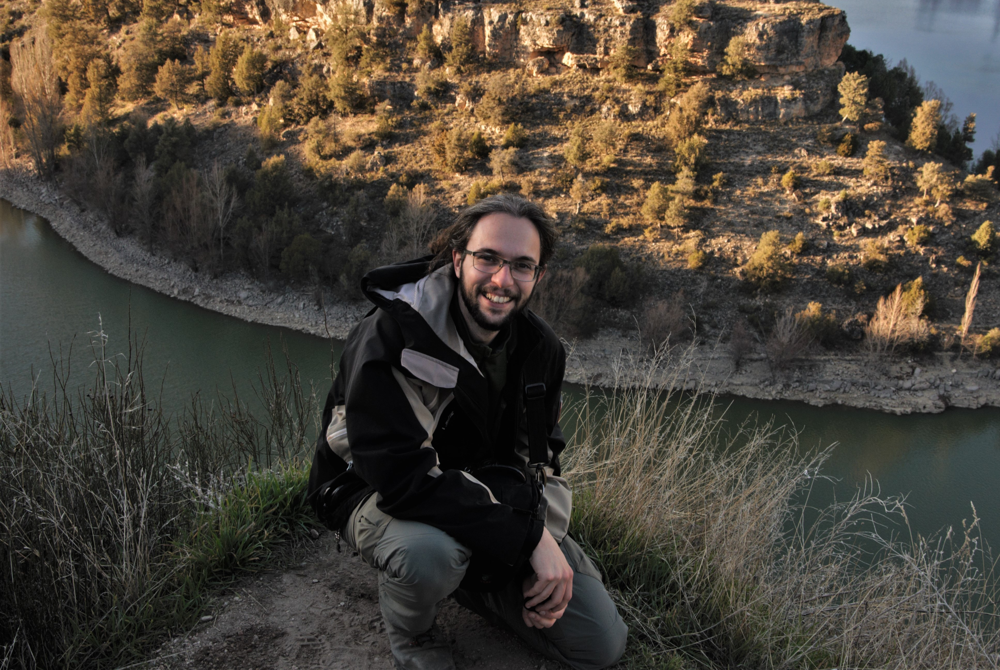

<figure class = "half">
  
  <h4> Juan G. Rubalcaba </h4> 
    
 jg.rubalcaba@gmail.com  

    
 Dept Biodiversity, Ecology and Evolution (Universidad Complutense de Madrid) 

    
 Despacho 18, planta 9, Fac CC Biológicas (Edificio A) 

</figure>
<h4> CV </h4> 

Sept 2026 - Ramón y Cajal researcher. Pyrenean Institute of Ecology (CSIC). 

March 2023 - Aug 2026. Senior Postdoc. Resesarch Talent Attraction (CAM). Universidad Complutense de Madrid. 

Dec 2019 - Nov 2022. Marie Skłodowska-Curie Global Fellow. McGill Unviersity (Montreal) - Rey Juan Carlos Unviersity (Madrid) 

Feb 2019 - Nov 2019. Visiting Reasearcher. University of Montana. 

March 2017 - Feb 2019. Postdoctoral fellow. Rey Juan Carlos University (Madrid) 

Dec 2012 - Jan 2017. PhD Student. Rey Juan Carlos University (Madrid) 

